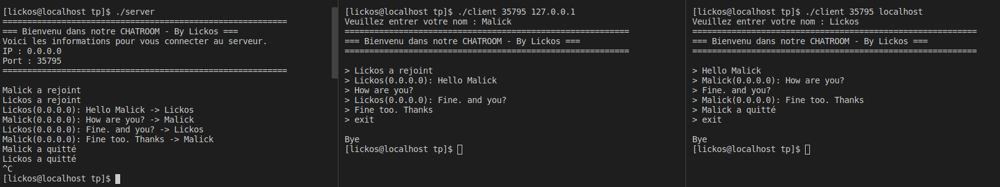

#chatroom-in-c
----

Un simple Chatroom construit en langage de programmation C. Le programme a deux fichiers - server.c et client.c. Le programme utilise le multithreading pour gérer plusieurs clients.

Pour exécuter le projet, exécutez la commande suivante:
```bash
$ make Makefile compile
```

Pour lancer le serveur:
```bash
$./server
```


Pour lancer le client
```bash
$ ./client <port> <ip>
```

Output




By [Lickos](https://twitter.com/LickosA)

